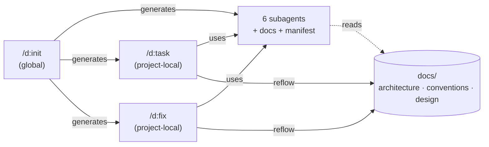
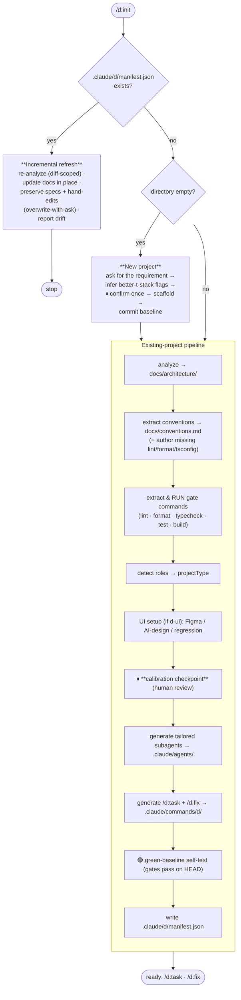
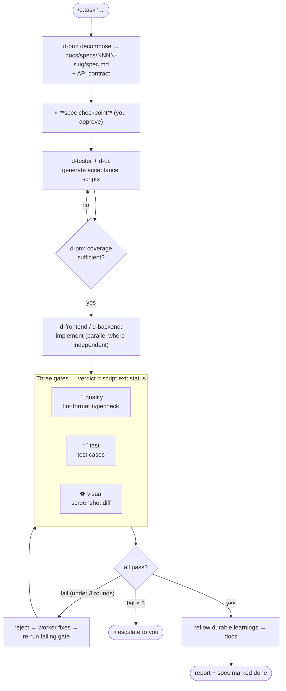
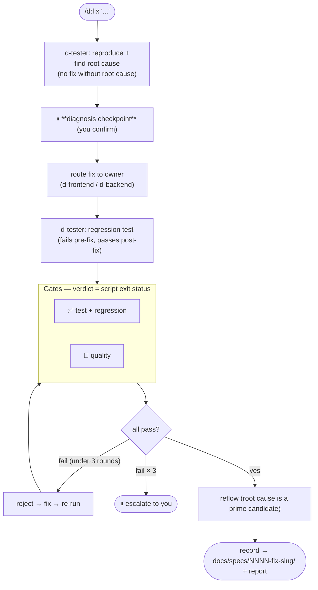
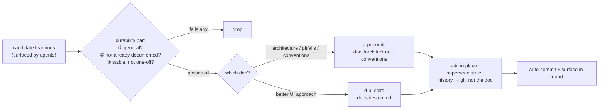

# `d` — AI Project Workflow Engine

A Claude Code plugin that turns a single command into a complete, project-tailored development workflow. Run `/d:init` in any project and `d` analyzes it (or scaffolds a new one), writes living architecture/convention docs, generates a team of specialized subagents bound to *your* codebase, and gives you two project-local commands — `/d:task` to ship a requirement and `/d:fix` to kill a bug — each guarded by **three script-based quality gates** and a **knowledge-reflow** step that keeps the docs fresh but lean.

> **The core idea:** the framework is generic, but every artifact it generates is *fit to your project* — produced by real analysis + a calibration checkpoint + a green-baseline self-test, not by stamping out templates.

---

## Why

Long-lived projects rot when every new requirement is built with different conventions, untested, and undocumented. `d` makes consistency **mechanical**, not a matter of remembering:

- **Conventions are enforced, not suggested** — lint/format/typecheck run as a real gate, alongside tests and visual regression.
- **Docs are a source of truth that grows but stays lean** — every task/fix reflows durable learnings back into them, editing in place.
- **Subagents are bound to your architecture** — the project's rules and real exemplar files are inlined into each agent.

---

## Install

```bash
claude plugin marketplace add /path/to/cc-commands
claude plugin install d@d-dev
```

Then, in any project:

```bash
/d:init            # set up the workflow (detects new / existing / re-run)
/d:task "<requirement>"   # iterate a feature
/d:fix  "<bug>"           # diagnose + fix a bug
```

---

## The three commands at a glance



---

## `/d:init` — set up (or scaffold) the project

`/d:init` is the only global command. It detects three situations and routes accordingly.



**Two things make the output fit your project, not generic:**

- ⏸ **Calibration checkpoint** — before generating anything, `d` shows you the extracted architecture, conventions, role roster, and the resolved gate commands so you can correct them.
- 🟢 **Green-baseline self-test** — after generating, it runs the quality + test gates against your current `HEAD`. If a gate fails on clean code, the gate config is wrong and gets fixed before finishing.

---

## The subagents

`/d:init` generates only the roles your project needs. Three are always present; three are conditional.

| Agent | Role | Generated when |
|---|---|---|
| `d-pm` | Splits requirements into specs + API contracts; coverage-gates tests; owns doc reflow | always |
| `d-tester` | Writes real test cases (the **test gate**); root-cause analysis for fixes | always |
| `d-reviewer` | Runs lint + format + typecheck (the **quality gate**); convention review | always |
| `d-frontend` | Implements the frontend | a UI layer exists |
| `d-backend` | Implements the backend / API / DB | a server layer exists |
| `d-ui` | Owns the **visual gate**; authors `docs/design.md` | a UI layer exists |

Each worker has the project's conventions and real exemplar file paths inlined into its prompt — so it imitates your real code, not a generic ideal.

---

## `/d:task` — iterate a requirement

The main agent acts as conductor (subagents can't dispatch subagents). One human checkpoint after the spec; then it runs automatically through the three gates with a bounded reject loop.



---

## `/d:fix` — diagnose and fix a bug

Symmetric to `/d:task`, but **root-cause first**: no fix is written until the diagnosis is confirmed, and verification centers on a regression test.



---

## Knowledge reflow — docs that grow but stay lean

Every successful `/d:task` and `/d:fix` ends with a reflow step, so the docs never drift from reality and never bloat.



---

## What a managed project looks like

```
your-project/
├── docs/
│   ├── architecture/        # extracted, kept current by reflow
│   │   └── overview.md
│   ├── conventions.md       # code source of truth (enforced by the quality gate)
│   ├── design.md            # UI source of truth (when AI decides UI)
│   └── specs/
│       └── 0001-some-feature/spec.md
└── .claude/
    ├── agents/              # d-pm, d-tester, d-reviewer, d-frontend, d-backend, d-ui
    ├── commands/d/          # task.md, fix.md  (→ /d:task, /d:fix)
    └── d/manifest.json      # project type, stack, roles, gate commands, ui baseline
```

---

## Design principles

- **Fit beats templates** — generic engine, project-specific output via analysis + calibration + green-baseline.
- **Gates are mechanical** — quality/test/visual verdicts come from script exit status, never vibes.
- **One human stop per command** — spec (task) / diagnosis (fix) checkpoints; everything else is automatic, with a 3-round reject cap before escalation.
- **Self-contained, opportunistically smart** — works standalone; uses installed skills (e.g. `systematic-debugging`, `design-review`) when present.
- **Docs are living and lean** — reflow edits in place; history lives in git.

---

## Project status

| Phase | Scope | Status |
|---|---|---|
| 1 | Foundation + `/d:init` (existing project) | ✅ |
| 2 | `/d:task` iteration | ✅ |
| 3 | `/d:fix` bug-fix | ✅ |
| 4 | New project (better-t-stack) + incremental refresh | ✅ |

The full design spec and per-phase implementation plans live in [`docs/superpowers/`](docs/superpowers/).

New projects are scaffolded with [Better-T Stack](https://better-t-stack.dev/).
